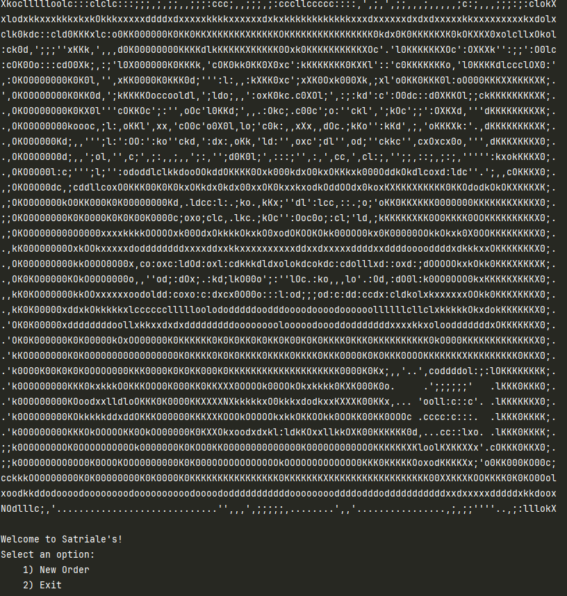
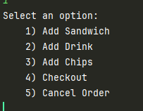
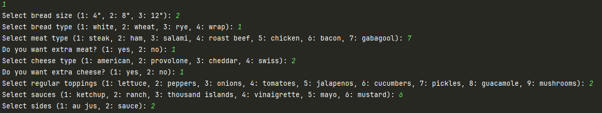
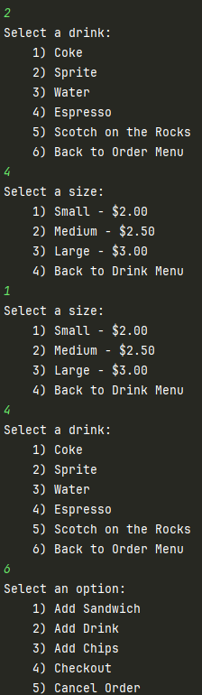
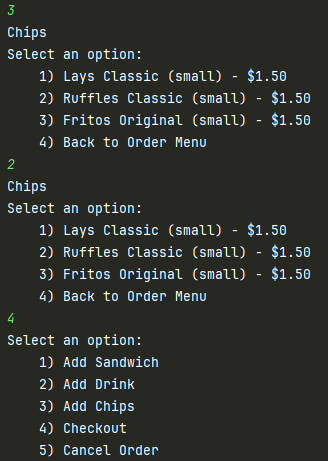
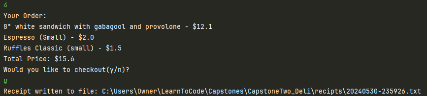
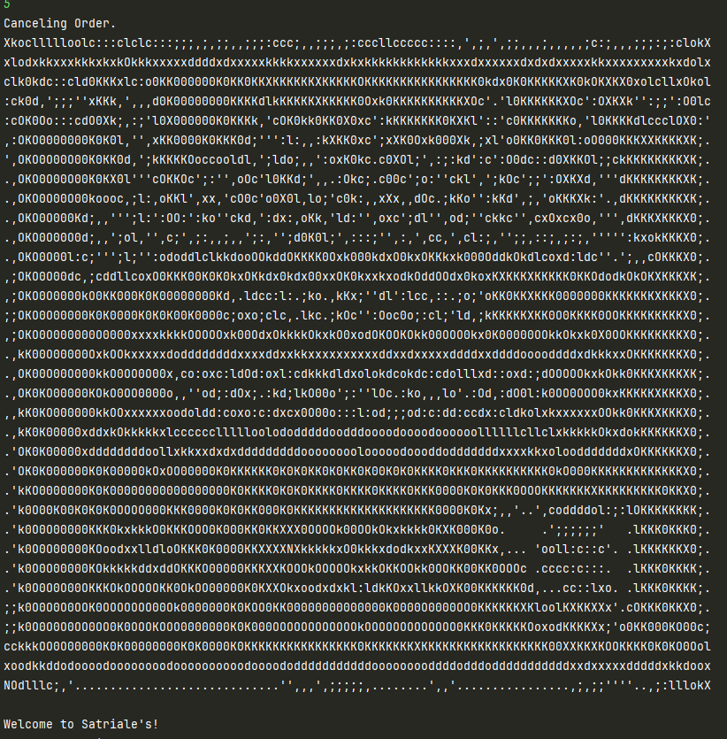
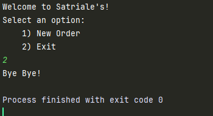
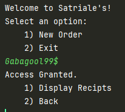

# CapstoneTwo_Deli

## Table of Contents

- [Features](#features)
- [Menus/Walkthrough](#menus/walthrough)
- [Interesting Code/Feature](#interesting-code/feature)
- [Future Features](#future-features)

## Features

- Create custom sandwich(es) with multiple toppings
- Add Chips and drinks of multiple sizes
- Writing receipt of order after checkout to a file

## Menus/Walkthrough

Click to Start

### Home Screen

New Order

### Order Screen

Add Sandwich

Add Drink

Add Chips

Checkout

Cancel Order

Exit

### Exit Screen

## Interesting Code/Feature
Hidden admin menu on Home Screen

Code

.png)

.png)

## Future Features

- Complete Admin menu
- Read receipts
  - filter receipts by date
- Combo meals